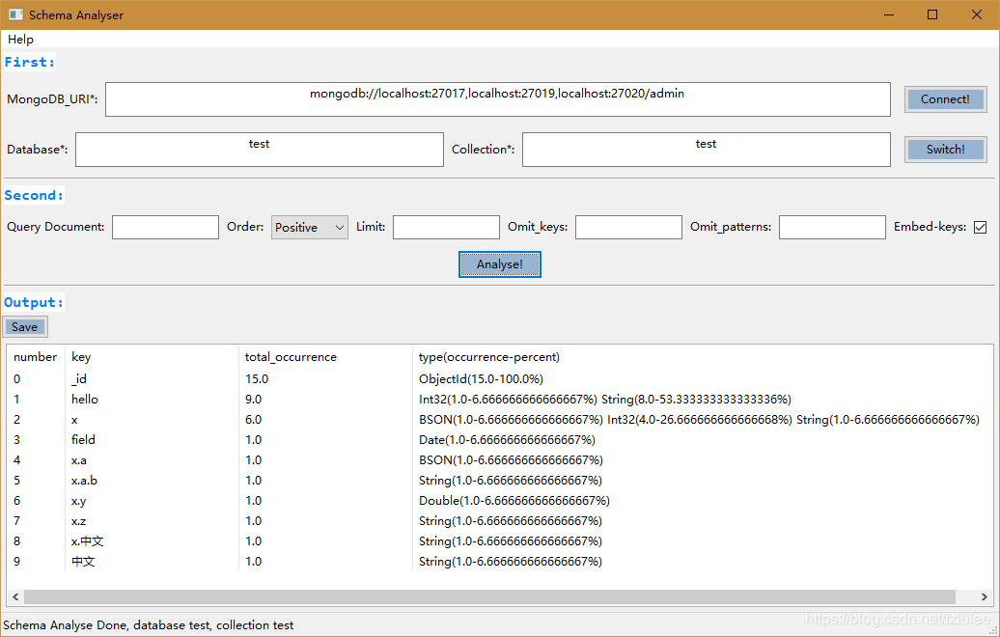

# PyMonSchema
Another free MongoDB schema analyser based on [PyMongo](https://github.com/mongodb/mongo-python-driver) and [wxPython](https://github.com/wxWidgets/wxPython).
Fast and Effective by using MongoDB MapReduce to analyse collection schema, simple yet powerful.

Author: HanseyLee

# Screeshot


# Usage
Using Python 3.
```bash
$ pip install -r requirements.txt
$ python pyMonSchema 
```
Also, you can package it as a executive program using pyinstaller.

After starting, two steps for operation:
### First:
Several required fields:

    - Fill MongoDB uri and click Connect button to connect MongoDB deployment. MongoDB uri, refer to https://docs.mongodb.com/manual/reference/connection-string .
    - Fill database name and collection name to switch to specific collection.

### Second:
After connect and switch to specific collection, there are several optional fields before analyse schema.

    - Query -> MongoDB query document to filter input to analyse. e.g. {"keyName": {"$in": ["key1", "key2"]}}, {"keyName": {"$exists": True}}(Note: PyMonSchema use Python Method "eval()" to deserialize query string, so use 'True'/'False' if query string contains bool value)
    - Order -> Positive/Negative, used in sort document, order=Positive equivalent to sort("_id":1), order=Negative equivalent to sort("_id":-1).
    - Limit -> Int, limit value of query result. Empty default is 0, which means no limit.
    - Omit_keys -> Fields string to be omitted, sperate by comma. such as: keyName1, keyName2 .
    - Omit_patterns -> Fileds match these regular expression patterns will be omitted, sperate by comma. such as: ^keyNameHead, keyNameTail$ .
    - Embed-keys -> Whether to analyse embed-key (e.g. keyNameParent.keyNameChild1.keyNameChild2) or not.
    - Analyse -> Run analyse.

### Output:
Display schema result.

    - Save button -> save the result as a json file named databaseName_collectionName-Schema.json default. The output json file like this:
    ```json
    [
        {
            "key": "_id",
            "total_occurrence": 15.0,
            "statics": [
                {
                    "type": "ObjectId",
                    "occurrence": 15.0,
                    "percent": 100.0
                }
            ]
        },
        {
            "key": "hello",
            "total_occurrence": 9.0,
            "statics": [
                {
                    "type": "Int32",
                    "occurrence": 1.0,
                    "percent": 6.666666666666667
                },
                {
                    "type": "String",
                    "occurrence": 8.0,
                    "percent": 53.333333333333336
                }
            ]
        },
        ...
    ]
    ```
# Contribution
welcome to contribute your code to improve this poor tool :P

